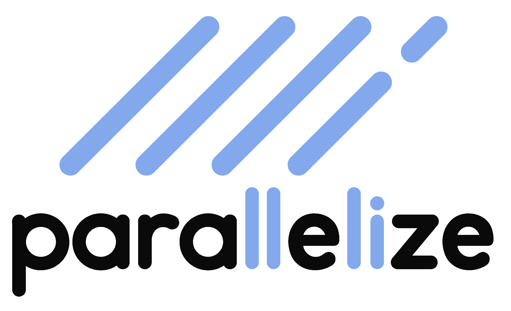

## Marcos Alonso Campillo
 
## Juan Trillo Carreras
 
## Juan Jerez Poblaciones
 
## Jaime González Fábregas

## Jaime Pablo Vázquez Martín

## Diego Quiroga Jaldín

 

# Concepto

Bienvenido a nuestra revolucionaria aplicación de computación distribuida, Parallelize. ¿Alguna vez has querido procesar un programa, pero tu ordenador no tiene suficiente capacidad para hacerlo?

Nuestra aplicación es una plataforma que permite a las personas compartir el poder de cómputo de sus ordenadores. Esto puede ser útil para tareas que requieren mucha potencia de procesamiento, como hacer grandes cálculos matemáticos o entrenar redes neuronales no profesionales.

Los usuarios pueden ofrecer su ordenador para el procesamiento de programas y recibir créditos a cambio o simplemente comprarlos para poder hacer uso del poder de la red. Los créditos obtenidos pueden ser retirados o reinvertidos para el procesamiento de nuevos programas.

 

# Usuarios y tareas

Habrá un único tipo de usuario. Las tareas serán:

*   Iniciar sesión y registrarse en la web.
*   Subir kernels propios.
*   Ejecutar kernels de la comunidad.
*   Introducir y retirar dinero en forma de créditos.
*   pueden denunciar kernels

Los administradores:
*   Judgarán las denuncias 

La web también hará ciertas operaciones.

*   Evaluar la complejidad de los kernels para realizar una estimación de la complejidad.
*   Calcular un ranking de participación visible para los usuarios.
*   Aviso de inanición
